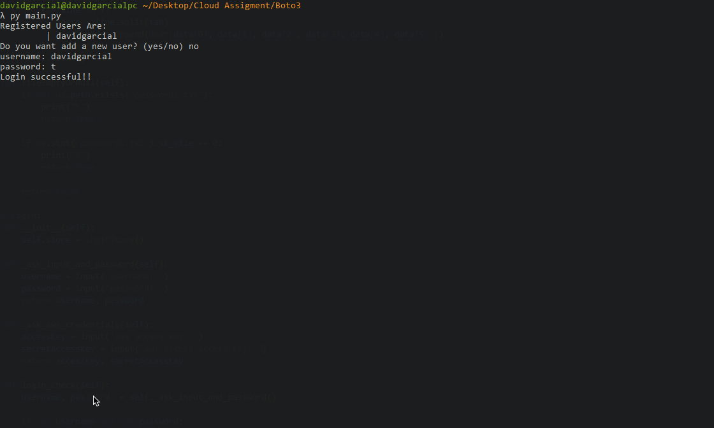
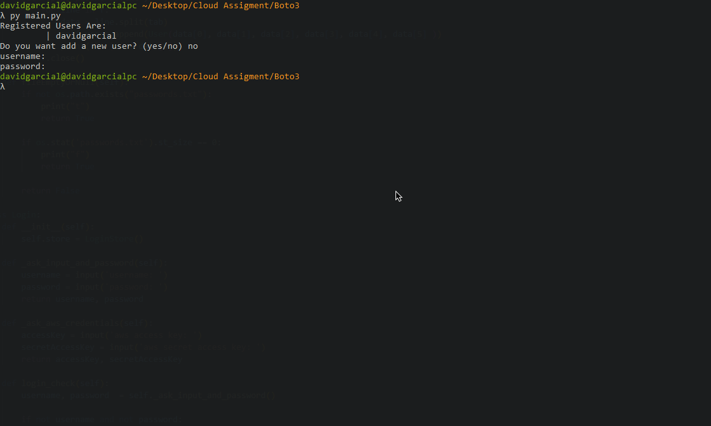
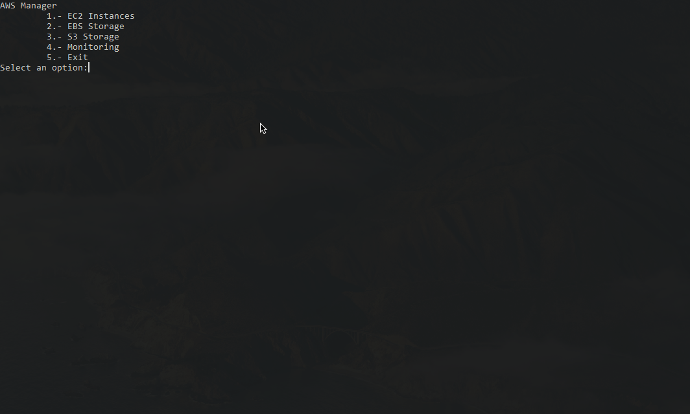
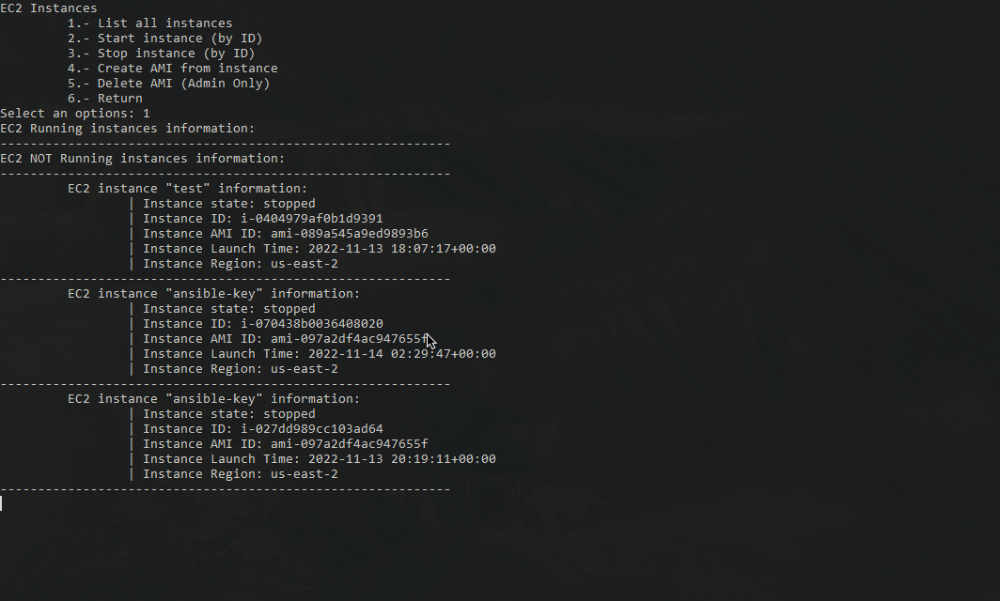
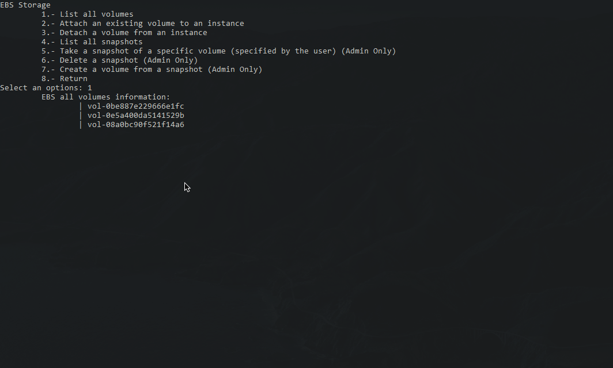
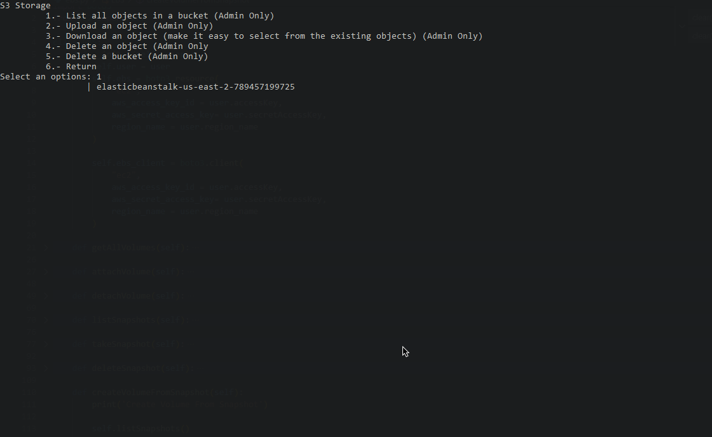
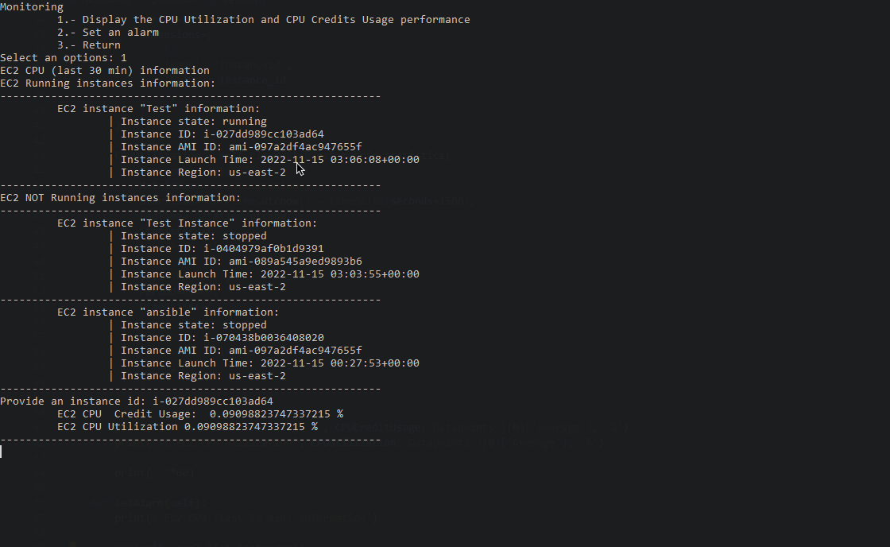

# Cloud Assignment IaaS and Python 

Hi, glad that you are reading this, sorry if its not the fancier code 
but its my first time in python and i make my best (dont be that hard xd)

So in order to launch the app python and boto3 are needed
* https://www.python.org/downloads/
* https://github.com/boto/boto3

Then just target the main file with will redirect you to the login
> py main.py

You are able to create a new user or use one of the previously created

In order to create a user is necessary a user name,password,aws key,aws secret key and define if the user gonna be an admin or just a regular user

If you provide empty values the program will exit

If the login was successfull you will be redirected to the main menu that shows items dependig of your user type

If you want more detailed images of the functionality check the folder 'ss'
Here are some examples

https://github.com/davidgarcial/aws-cli-tool-python-boto3